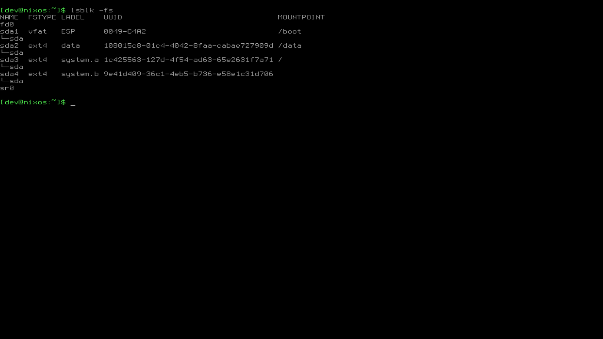

# Dividat Linux

** WORK IN PROGRESS - currently only useable as technology demonstrator **

A custom Linux system for running Dividat Play.

This is a [NixOS](https://nixos.org/) based system that runs Dividat Play in a restricted Kios environment. Deployed machines have two partitions (A/B) that can be updated atomically over-the-air. After succesfull update machine can reboot into the new system. System is compatible with NixOS modules and packages and everything that is available from upstream NixOS can be used.

## Overview

### Components

- Bootloader: [GNU Grub](https://www.gnu.org/software/grub/) is used as bootloader.
- Update Client: [RAUC](https://rauc.io/) manages installation of new system images and interfaces with Bootloader to set correct boot target.
- Play Computer Controller (not yet implemented):
  - Periodically checks for update and provides them to RAUC when available.
  - Provide TUI for on-site configuration of system (Networking, wipe data partition, etc.)
- Installer (not yet implemented): A bootable SD image for deployment.

## Quick start

Running `nix build` will create following (in `result/`):

- `system.tar.xz`: Tarball of entire system as defined in [`system/configuration.nix`](system/configuration.nix) (this is a standard NixOS configuration file, see https://nixos.org/nixos/manual/index.html#ch-configuration).
- `bundle-VERSION.raucb`: RAUC bundle that can be used to update systems. Note that it is signed with a dummy development key. Real deployments would resign the key with `rauc resign`.
- `disk.img`: Preinstalled system with A/B and data partitions for testing.

### Virtual machine

A helper is available to quickly start a virtual machine (QEMU needs to be available):

```
nix-shell --command "make qemu"
```

## Demo

### GRUB


Machine will boot and show a GRUB menu. The preferred system to boot is automatically booted after 3 seconds.

### Login


Login using user `dev` and password `123`.

### Partitioning

System has 4 partitions:

- EFI system partition
- `data` partition for persistent data
- `system.a`
- `system.b`



### RAUC

RAUC status can be queried with the command `rauc status`:


Install a new bundle with the `rauc install` command (bundle needs to be transferred to virtual machine first):


## Todos

This is an incomplete list and is mainly here to document already planned improvements (in no particular order):

- [ ] Make root file system read only
- [ ] Move RAUC specific configuration in [`system/configuration.nix`](system/configuration.nix) to a seperate file.
- [ ] Set up proper signing for RAUC bundles
- [ ] Installer
  - [ ] Move installation logic from [`lib/make-disk-image.nix`](lib/make-disk-image.nix) to an installer script
  - [ ] Create a bootable SD image that runs the installer script
- [ ] Play Computer Controller
- [ ] High-level stuff
  - [ ] Dividat Driver
  - [ ] Chromium Kiosk

## Related work

- [Yocto](https://www.yoctoproject.org/): A builder for embedded Linux distributions. Widely used but not very well suited for desktop functionality (such as browser).
- [Buildroot](https://buildroot.org/): Builder for embedded Linux systems. Also not very well suited for desktop functionality.
- [not-os](https://github.com/cleverca22/not-os): A NixOS based system generator. Much more minimal than NixOS, does not use systemd and is not compatible with existing NixOS modules.
